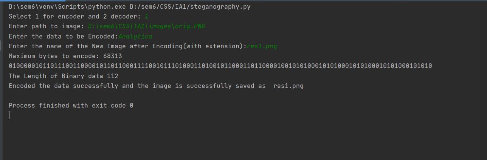
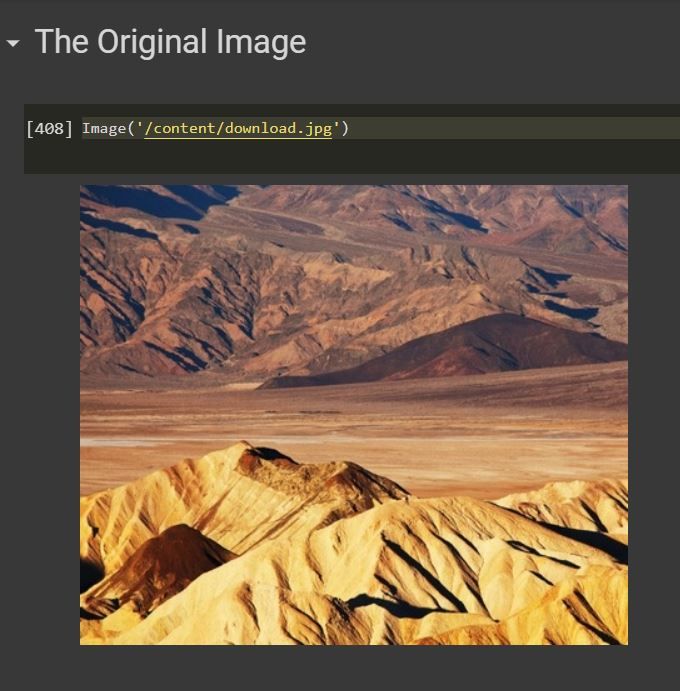
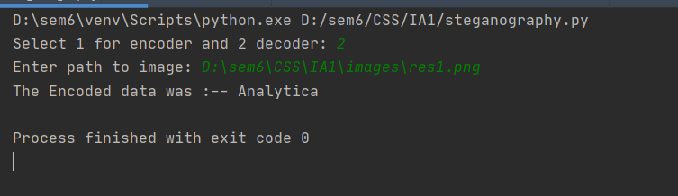

# ConcealIt-Text Steganography
## Encode and decode text

Steganography is the practice of concealing a message within another message or a physical object.
In computing/electronic contexts, a computer file, message, image, or video is concealed within another file, message, image, or video. 
Generally, the hidden messages appear to be (or to be part of) something else: images, articles, shopping lists, or some other cover text. 
For example, the hidden message may be in invisible ink between the visible lines of a private letter. 
Some implementations of steganography that lack a shared secret are forms of security through obscurity, and key-dependent 
steganographic schemes adhere to Kerckhoffs's principle.The advantage of steganography over cryptography alone is that the intended secret message
does not attract attention to itself as an object of scrutiny. Plainly visible encrypted messages, no matter how unbreakable they are, arouse interest
and may in themselves be incriminating in countries in which encryption is illegal.
Whereas cryptography is the practice of protecting the contents of a message alone, steganography is concerned with concealing the fact that
a secret message is being sent and its contents.

Steganography includes the concealment of information within computer files. In digital steganography, electronic communications may include steganographic
coding inside of a transport layer, such as a document file, image file, program, or protocol. Media files are ideal for steganographic transmission because
of their large size. For example, a sender might start with an innocuous image file and adjust the color of every hundredth pixel to correspond to a letter
in the alphabet. The change is so subtle that someone who is not specifically looking for it is unlikely to notice the change.

Text steganography is a mechanism of hiding secret text message inside another text as a covering message or generating a
cover message related with the original secret message. 

## Features

- 
---

### Example for using

---
### Output images :

### - Encoding

### - Decoding

---

 #### Features to be added :
- 

---
